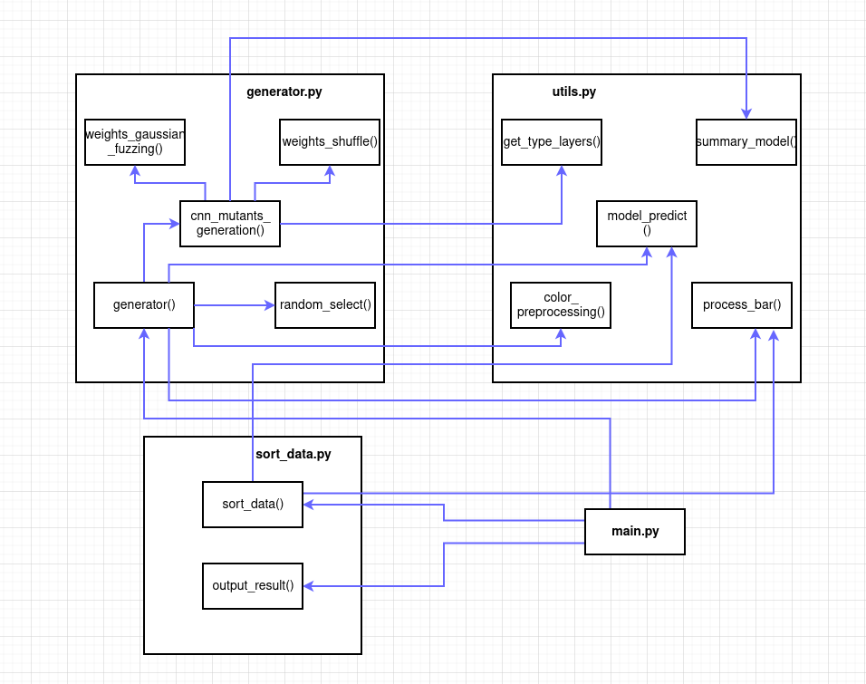
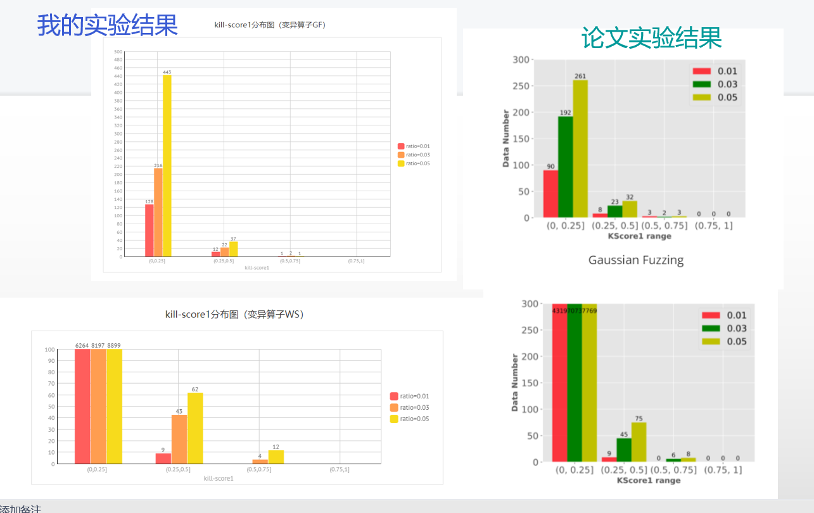

# 项目文档
## 项目结构
```
|- model                        # 存储用于手写数字和机器打印字符图片识别的神经网络模型LeNet-5 的文件夹。
|                               # 该模型作为用于生成突变模型的原始模型，
|                               # 其在mnist测试集上准确率为0.9892。
|- result_of_kill_number        # 存储mnist每个测试集的kill-number（以.npz文件形式）的文件夹
|- save_mutation_GF_0.01        # 存储使用GF突变算子，ratio=0.01生成的200个突变体的文件夹
|- save_mutation_GF_0.03        # 存储使用GF突变算子，ratio=0.03生成的200个突变体的文件夹
|- save_mutation_GF_0.05        # 存储使用GF突变算子，ratio=0.05生成的200个突变体的文件夹
|- save_mutation_WS_0.01        # 存储使用WS突变算子，ratio=0.01生成的200个突变体的文件夹
|- save_mutation_WS_0.03        # 存储使用WS突变算子，ratio=0.03生成的200个突变体的文件夹
|- save_mutation_WS_0.05        # 存储使用WS突变算子，ratio=0.05生成的200个突变体的文件夹
|- generator.py                 # 生成突变体
|- main.py                      # 启动主函数
|- sort_data.py                 # 计算测试集的kill-number, 并以.npz文件形式储存
|- utils.py                     # 有一些通用的函数
|- 函数依赖关系图.png
|- 项目文档.md
|- 工具理解.pptx
|- 讲解时评.mp4 				 # 见b站：
```

## 函数介绍
### utils.py
1. `get_type_layers(model)`:

  返回一个DL模型的不同类型(密集层、卷积层、密集平坦层、平坦层)的层列表。
2. `color_preprocessing(x_train, x_test, mean, std)`:

  数据集预处理函数——使用`astype('float')`对多维数据集进行类型转换；为方便训练和测试，将数据集进行归一化处理（如：`x_test = (x_test - mean) / std`）。
3. `summary_model(model)`:

  返回一个模型的总权重数，总神经数，每层对应的权重数字典，每层对应的神经数字典。
4. `model_predict(model, x, y)`:

  计算模型的准确率——x为测试输入，y为测试预言，模型输入测试集后得到一个结果，通过比较该结果和测试预言获得模型的准确率。
5. `process_bar(num, total)`:

  定义一个进度条，可视化程序运行流程。

### generator.py
1. `random_select(total_num, select_num, layer_list, layer_dict)`:

  返回一个随机生成的待突变处理的模型层次列表（如果列表某位为0，说明该位指向的层次无需突变处理）；
  调用`numpy.random.choice(a, size=None, replace=True, p=None)`API实现随机处理。
2. `weights_gaussian_fuzzing(weights, process_num, standard_deviation=0.5)`:

  对某个待突变处理的层次的权重执行基于高斯分布的模糊化；调用`numpy.random.normal(loc=0.0, scale=standard_deviation, size=None)`API实现权重的高斯分布模拟化，从而得到新的权重。
3. `weights_shuffle(weights, process_num)`:

  对某个待突变处理的层次的权重执行权重打乱操作；调用`np.random.shuffle(weights)`API实现数据的随机打乱。
4. `cnn_mutants_generation(model, ratio, standard_deviation, operator)`:

  根据operator(0-GF突变算子，1-WS突变算子)和ratio等进行对原始模型的突变体生成操作；需要调用上述1，2，3的函数,以及`utils.py`的`summary_model()`、`get_type_layers()`。
5. `generator(op, ratio)`:
    对外接口，规定了突变体的存储位置、个数，并进行了简单的输出信息处理；需要调用上述4的函数，以及`utils.py`的`color_preprocessing()`、`model_predict()`、`process_bar()`。

### sort_data.py
1. `sort_data(ori_model_path, mutants_path, save_path)`:

  对mnist的10000个测试集进行测试是否杀死变异体的操作，记录每个测试集杀死的变异体个数（共200个变异体）；需要调用`utils.py`的`model_predict()`、`process_bar()`。
2. `output_result(result_path)`:

  读.npz文件，输出kill-number分别落入(0,50],(500,100],(100,150],(150,200]四个区间的测试集个数到控制台。

### main.py
  主函数，设置`ratio`和变异算子，完成变异体生成、kill-number计算的接口；需要调用`generator.py`的`generator()`,`sort_data.py`的`sort_data()`、`output_result()`;

  基本模板如下：
  ```
generator(0, 0.05)
sort_data(model_path, "save_mutation_GF_0.05", save_path+"lenet5-gf-0.05.npz")
print("ratio=0.05, GF")
output_result(save_path+"lenet5-gf-0.05.npz")
  ```

## 函数依赖关系图


## 项目使用的关键API包
### Keras
Keras 是一个用 Python 编写的深度学习 API，运行在机器学习平台 TensorFlow 之上。Keras的神经网络API是在封装后与使用者直接进行交互的API组件，在使用时可以调用Keras的其它组件。除数据预处理外，使用者可以通过神经网络API实现机器学习任务中的常见操作，包括人工神经网络的构建、编译、学习、评估、测试等。
具体见https://keras.io/about/
### NumPy
NumPy是Python的一种开源的数值计算扩展。这种工具可用来存储和处理大型矩阵，支持大量的维度数组与矩阵运算，此外也针对数组运算提供大量的数学函数库，对于深度学习领域实用性很高。

## 工具验证

### 使用的原始模型

lenet-5识别手写图片中的数字的深度学习模型

### 使用的测试数据集

mnist数据集中的10000个测试集

### 验证流程

通过用GF、WS变异算子分别以ratio=0.05/0.03/0.01对lenet-5模型进行200个变异体生成（即六种情况——GF-0.05、GF-0.03、GF-0.01、WS-0.05、WS-0.03、WS-0.01）。对每种情况计算kill-score1，最后生成针对不同变异算子的kill-score1分布图。

### 实验结果


